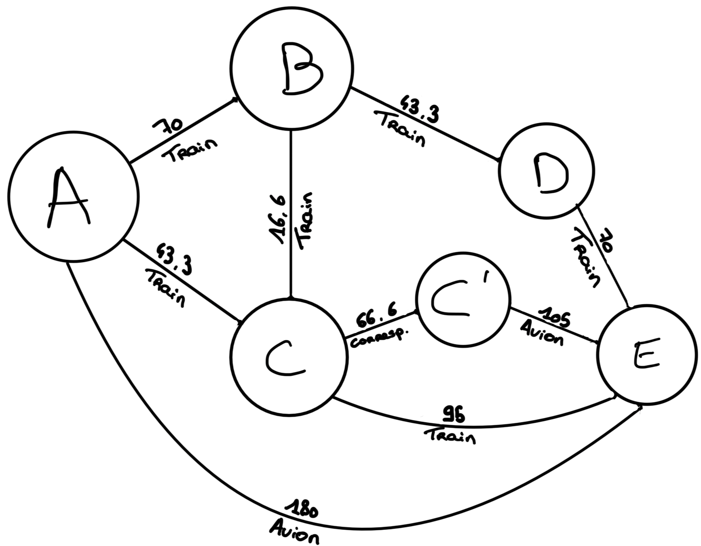

------------------------------------------

SAE S2.02 -- Rapport pour la ressource Graphes
===

*LECOCQ, VANHOUTTE, Groupe E*

Version 1 : un seul moyen de transport
---

### Présentation d'un exemple

Lisa habite dans la ville A, aujourd'hui elle se rend chez sa grand-mère qui habite dans la ville E pour les vacances.   
La ville A et la ville D sont reliées par différents axes :
  - un axe ferroviaire de la ville A à la ville B, ayant un coût financier de 50 €, une durée de 60 minutes et un rejet de C02 de 1,7 kg CO2e.
  - un axe ferroviaire de la ville A à la ville C, ayant un coût financier de 30 €, une durée de 40 minutes et un rejet de CO2 de 1,4 kg CO2e.
  - un axe ferroviaire de la ville B à la ville C, ayant un coût financier de 20 €, une durée de 50 minutes et un rejet de CO2 de 1,4 kg CO2e.
  - un axe ferroviaire de la ville B à la ville D, ayant un coût financier de 30 €, une durée de 40 minutes et un rejet de CO2 de 2,4 kg CO2e.
  - un axe ferroviaire de la ville C à la ville E, ayant un coût financier de 65 €, une durée de 90 minutes et un rejet de CO2 de 1,2 kg CO2e.
  - un axe ferroviaire de la ville D à la ville E, ayant un coût financier de 50 €, une durée de 60 minutes et un rejet de CO2 de 1,3 kg CO2e.
  - un axe aérien de la ville A à la ville E, ayant un coût financier de 170 €, une durée de 30 minutes et un rejet de CO2 de 300 kg CO2e.  

Étant étudiante, Lisa possède un budget serré de 100 € pour ce voyage et cherche donc à minimiser le coût financier du transport, plutôt habitué avec ce moyen de transport, elle décide de prendre le train.  
Lisa souhaite pouvoir comparer les 3 trajets ayant le coût financier le plus faible et ne se déroulant qu'en train.  
Parmi l'ensemble des axes ferroviaires, les 3 meilleurs trajets basés sur les préférences de Lisa sont donc : 
  - ville A -> ville C -> ville E : 95€
  - ville A -> ville C -> ville B -> ville E : 130€
  - ville A -> ville B -> ville D -> ville E : 130€

En sachant que les deux derniers trajets dépassent le budget de Lisa, il ne lui reste plus qu'un trajet possible pour se rendre chez sa grand-mère.
Il faut donc qu'elle prenne le train de la villeA à villeC puis de la villeC à la villeE, pour un prix total de 95€.

### Modèle pour l'exemple

Dans le graphe, on ne modélise que les arêtes respectant les préférences de Lisa, on ne représente donc que les axes ferroviaires ainsi que leur prix.  
Les 3 plus courts chemins dans le graphe est le chemin [A, C, E] ayant un poids de 95, puis les chemins [A, C, B, E] et [A, B, D, E] ayant tous deux un poids de 130.

### Modélisation pour la Version 1 dans le cas général 

Basés sur les données du problème, les arêtes du graphe seront les différents lieux et les arêtes représenteront les différents axes reliant ces lieux.  
Le poids d'une arête sera définis en fonction des différents coûts de celle-ci (temps, prix, émissions...).
Les trajets optimaux pourront être déterminés grâce à l'algorithme de Dijkstra, qui prend en entrées un graphe valué G avec fonction de poids p et dont tous les poids sont positifs, ainsi qu'un point s0 dans G.

### Implémentation de la Version 1

La classe de tests est la classe **GrapheTest.java**, le commit associé est le da82035a1871f36148d4633f7114320a378a6c75 datant du 17/05/2024, qui peut être retrouvée [ici](https://gitlab.univ-lille.fr/sae2.01-2.02/2024/E4/-/commit/da82035a1871f36148d4633f7114320a378a6c75#f5ee136bacd34139f138ee76916440a4c0c4519c).

Version 2 : multimodalité et prise en compte des correspondances
---

### Présentation d'un exemple

Lisa habite dans la ville A, aujourd'hui elle se rend chez sa grand-mère qui habite dans la ville E pour les vacances.   
La ville A et la ville E sont reliées par différents axes :
  - un axe ferroviaire de la ville A à la ville B, ayant un coût financier de 50 €, une durée de 60 minutes et un rejet de CO2 de 1,7 kg CO2e.  
  - un axe ferroviaire de la ville A à la ville C, ayant un coût financier de 30 €, une durée de 40 minutes et un rejet de CO2 de 1,4 kg CO2e.  
  - un axe ferroviaire de la ville B à la ville C, ayant un coût financier de 20 €, une durée de 50 minutes et un rejet de CO2 de 1,4 kg CO2e.  
  - un axe ferroviaire de la ville B à la ville D, ayant un coût financier de 30 €, une durée de 40 minutes et un rejet de CO2 de 2,4 kg CO2e.  
  - un axe ferroviaire de la ville C à la ville E, ayant un coût financier de 65 €, une durée de 90 minutes et un rejet de CO2 de 1,2 kg CO2e.  
  - un axe ferroviaire de la ville D à la ville E, ayant un coût financier de 50 €, une durée de 60 minutes et un rejet de CO2 de 1,3 kg CO2e.  
  - un axe aérien de la ville C à la ville E, ayant un coût financier de 100 €, une durée de 15 minutes et un rejet de CO2 de 150 kg CO2e.  
  - un axe aérien de la ville A à la ville E, ayant un coût financier de 170 €, une durée de 30 minutes et un rejet de CO2 de 300 kg CO2e.  

La correspondance entre la gare de la ville C et son aéroport se fait en Train, et à un coût financier de 60 €, une durée de 20 minutes et un rejet de 0,1 kg CO2e.  
Pas très ponctuelle, Lisa est partie est retard et doit être au plus vite chez sa grand-mère pour un repas de famille, qui débute dans 1 h 30.  
Lisa souhaite pouvoir comparer les trois trajets ayant la durée la plus faible.
D'après ses critères, les trois meilleurs trajets sont les suivants :
  - Ville A à Ville E en Avion → 30 minutes
  - ville A à ville C en train, correspondance, puis ville C à ville E en avion → 75 minutes
  - ville A à ville E en passant par ville C → 130 minutes

En sachant que le dernier trajet dépasse le temps limite de Lisa qui est de 1 h 30, il ne lui reste plus que deux trajets possibles pour se rendre chez sa grand-mère.  
Le trajet optimal étant la ligne aérienne reliant la ville A à la ville E, avec une durée de 30 minutes.  

### Modèle pour l'exemple

  

Les trois plus courts chemins dans le graphe sont [A, E] avec un poids de 30, [A, C, C', E] avec un poids de 75 puis [A, C, E] avec un poids de 130.  

### Modélisation pour la Version 2 dans le cas général

Le graphe de la version 2 est structuré de la même façon que celui de la version 1, les sommets représentent les villes tandis que les arêtes représentent les axes reliant ces villes.
Les villes peuvent cependant être représentées plusieurs fois, avec des arêtes entre chacune d'entre elles, cela modélise les correspondances possibles s'il y a changement de modalité de transport au sein de cette même ville.  

### Implémentation de la Version 2

La classe de tests est la même classe que lors de la version 1, c'est-à-dire la classe **GrapheTest.java**, le commit associé est le e4082a1fdef6d17df2a22702615d72aeb5afe446 datant du 7/06/2024, qui peut être retrouvée [ici](https://gitlab.univ-lille.fr/sae2.01-2.02/2024/E4/-/blob/main/graphes/GrapheTest.java?ref_type=heads).

Version 3 : optimisation multi-critères
---

### Présentation d'un exemple  

Pour l'exemple de cette version 3, nous garderons le même que celui de la version 2.
Lisa cherche maintenant à prioriser le temps, mais également le prix afin de ne pas se ruiner.
Pour pouvoir calculer les trajets optimaux, il faut mettre en place un calcul prenant en compte les préférences de Lisa. Nous allons donc tout ramener sur un critère en €, chaque heure passée dans les transports est équivalente à 20€.
Avec les nouveaux coûts, les 3 plus courts chemins sont :
  - ville A -> ville C -> ville E  en train : 139,3€
  - ville A -> ville C -> ville B -> ville D -> ville E en train : 173,2€
  - ville A -> ville E en avion : 180€
  
Le trajet optimal d'après les critères de Lisa est donc ville A, ville C, ville E en train avec un coût unifié de 139,3€.

### Modèle pour l'exemple

  

Les 3 plus courts chemins dans le graphe sont : [A, C, E] avec un poids de 139,3, puis [A, C, B, D, E] avec 173,2 et enfin [A, E] avec un poids de 180.

### Modélisation pour la version 3 dans le cas général  

Le graphe de la version 3 est structuré de la même façon que celui de la version 2. Le seul changement réside dans la méthode de calcul du poids des arêtes, d'après les critères de Lisa, la méthode de calcul est la suivante : (prix + (durée/60)*20).

### Implémentation de la Version 3  

----------------------------------------------------

**Fin du rapport**

### Barème sur 30 pts

Toute question sur le barème est à adresser à iovka.boneva@univ-lille.fr

- Rapport non rendu à temps -> note 0 
- **(7, décomposé comme suit)** Divers
  - **(1,5)** Respect de la structure du rapport
  - **(1,5)** Section Version 1 rendue pour le 18/05/2024. Cette version peut contenir les parties en italique.
  - **(1,5)** Section Version 2 rendue pour le 08/06/2024. Cette version peut contenir les parties en italique.
  - **(1)** Utilisation de vocabulaire précis sur les graphes (termes vu en cours, noms des algorithmes, etc.)
  - **(1,5)** Style d'écriture fluide et compréhensible

- **(8, décomposé comme suit)** Solution pour la Version 1
  - **(2)** Exemple pertinent (illustre tous les aspects du problème) et lisible (en particulier, ni trop grand ni trop petit, bien présenté)
  - **(4)** Le modèle de l'exemple permet de trouver la solution sur l'exemple. La modélisation pour le cas général permet de résoudre le problème posé
  - **(2)** L'implémentation de l'exemple est correcte et fonctionnelle

- **(6, décomposé comme suit)** Solution pour la Version 2
  - **(1)** Exemple pertinent
  - **(4)** le modèle de l'exemple permet de trouver la solution sur l'exemple. La modélisation pour le cas général permet de résoudre le problème posé
  - **(1)** L'implémentation de l'exemple est correcte et fonctionnelle

- **(3)** Qualité de la description de la solution (concerne les sections "Modèlisation dans le cas général" pour les Versions 1 et 2):
  - La modélisation pour le cas général est décrite de manière abstraite mais précise et complète. Pour vous donner une idée, un·e étudiant·e de BUT qui a validé les ressources Graphes et Dev devrait être en mesure d'implémenter votre solution d'après la description que vous en faites, sans avoir à trop réfléchir.

- **(6)** Solution pour la Version 3: mêmes critères que pour la Version 2